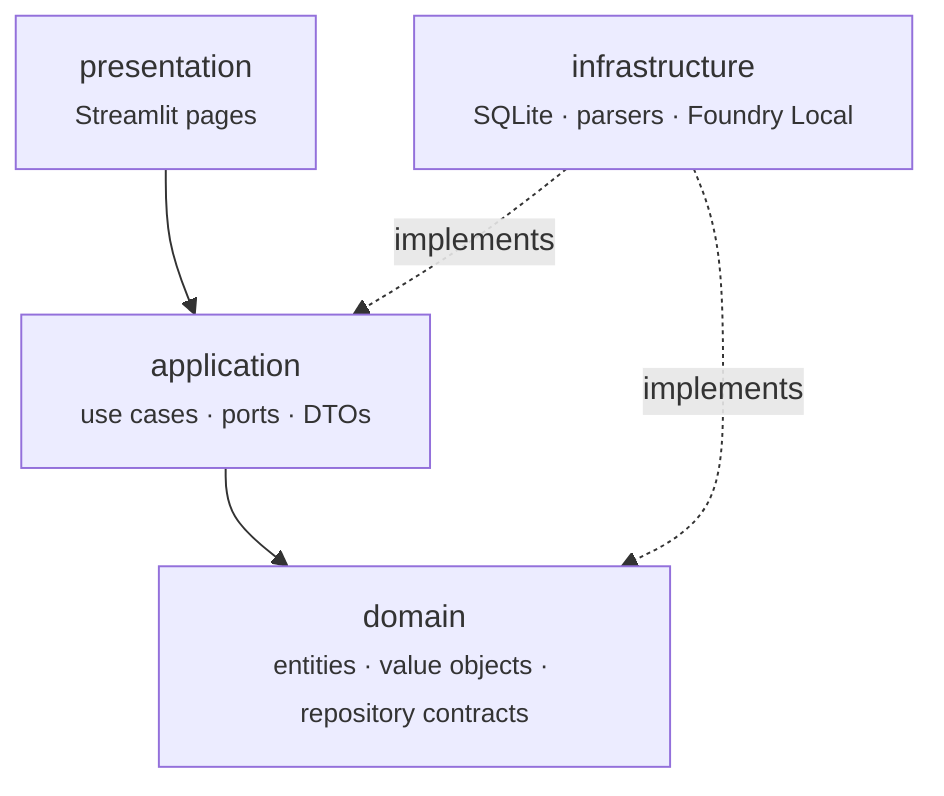

# DevMind AI

> **Ask your documentation.**

[](https://www.python.org/)
[](LICENSE)
[](docs/architecture.md)
[](https://streamlit.io/)

DevMind AI is a fully local Retrieval-Augmented Generation (RAG) application for
technical documentation. It indexes your documents, runs every model on your own
machine through **Microsoft Foundry Local**, and answers **only** from the
indexed sources - no cloud calls, no data leaving your device.

## Contents

- [Why](#why)
- [Highlights](#highlights)
- [First-release knowledge sources](#first-release-knowledge-sources)
- [Supported documents](#supported-documents)
- [Tech stack](#tech-stack)
- [Architecture](#architecture)
- [Project layout](#project-layout)
- [Getting started](#getting-started)
- [Usage](#usage)
- [Development](#development)
- [Roadmap](#roadmap)
- [Changelog](#changelog)
- [License](#license)

## Why

Technical documentation is large, fragmented and hard to search. DevMind AI turns
a documentation set into a grounded question-answering assistant that always
cites the source it used, and explicitly says when the answer is not in the
corpus.

## Highlights

- **100% local** - inference runs on Foundry Local; nothing is sent to a remote API.
- **Grounded answers** - responses are restricted to the indexed documentation,
  with a hard guarantee (not just a prompt) that the model is never even called
  when nothing relevant is indexed.
- **Source citations with confidence** - every answer names the documents it
  drew from and how closely each matched the question.
- **Clean Architecture** - domain logic is independent of frameworks and storage.
- **Lean dependency set** - SQLite for storage, Streamlit for the UI, no vector
  database.

## First-release knowledge sources

- Microsoft Learn
- ASP.NET Core Documentation
- .NET Architecture Guides

## Supported documents

| Format     | Extensions          | Extracted metadata            |
| ---------- | ------------------- | ------------------------------ |
| PDF        | `.pdf`              | Title, author, page count     |
| Word       | `.docx`             | Title, author                 |
| Markdown   | `.md`, `.markdown`  | Front matter, first heading   |
| Plain text | `.txt`              | Title derived from first line |

Whatever the format, parsing yields the same `ParsedDocument`: normalised
plain text plus uniform metadata, including a SHA-256 checksum used to
detect duplicates and changes between ingestion runs.

## Tech stack

| Concern        | Technology                        |
| -------------- | --------------------------------- |
| Language       | Python 3.13                       |
| Inference      | Microsoft Foundry Local           |
| Storage        | SQLite                            |
| User interface | Streamlit                         |
| Parsing        | pypdf, python-docx, markdown      |

## Architecture

The project follows Clean Architecture. Dependencies point inwards only:



| Layer            | Package                  | Responsibility                                        |
| ---------------- | ------------------------ | ----------------------------------------------------- |
| Core             | `devmind/core`           | Configuration, logging, base exceptions                |
| Domain           | `devmind/domain`         | Entities, value objects, repository contracts          |
| Application      | `devmind/application`    | Use cases, DTOs, ports                                 |
| Infrastructure   | `devmind/infrastructure` | SQLite, parsers, embeddings, Foundry Local client      |
| Presentation     | `devmind/presentation`   | Streamlit user interface                               |

See [docs/architecture.md](docs/architecture.md) for the full layer rules,
plus sequence diagrams of the indexing and question-answering flows.

## Project layout

```
.
├── app.py                     # Streamlit entry point: streamlit run app.py
├── devmind/
│   ├── core/                  # Config, logging, base exceptions
│   ├── domain/                # entities/, value_objects/, repositories/
│   ├── application/           # dto/, interfaces/, use_cases/, prompt_builder.py
│   ├── infrastructure/        # persistence/, parsers/, chunking/, embeddings/,
│   │                          # llm/, chat_service.py, knowledge_base_service.py
│   └── presentation/
│       └── ui/                # app.py (navigation), services.py, pages/
├── data/
│   ├── documents/             # Source documents (git-ignored)
│   └── db/                    # SQLite database (git-ignored)
├── docs/                      # architecture.md, installation.md, usage.md
├── logs/                      # Rotating log files (git-ignored)
├── tests/
│   ├── unit/
│   └── integration/
├── .env.example
├── requirements.txt
└── requirements-dev.txt
```

## Getting started

Full step-by-step instructions, including installing Foundry Local and
troubleshooting, are in **[docs/installation.md](docs/installation.md)**.
Short version:

### Prerequisites

- Python 3.13 or newer
- [Microsoft Foundry Local](https://learn.microsoft.com/azure/ai-foundry/foundry-local/)
  installed and running

### Installation

```bash
python -m venv .venv
```

```bash
.venv\Scripts\activate
```

```bash
pip install -r requirements.txt
```

### Configuration

Copy the environment template and adjust it to your setup:

```bash
copy .env.example .env
```

Every setting has a safe default, so an empty `.env` is valid. Real environment
variables always take precedence over `.env` entries. Confirm the Foundry Local
endpoint with:

```bash
foundry service status
```

### Running the application

```bash
streamlit run app.py
```

Open the printed local URL and use the sidebar to move between **Chat**,
**Upload Documents**, **Knowledge Base** and **Settings**.

## Usage

1. **Upload Documents** - add PDF, DOCX, Markdown or text files; DevMind AI
   parses, chunks and embeds anything new, and skips files that have not
   changed since the last upload.
2. **Chat** - ask a question in plain language. A grounded answer names its
   sources and each one's confidence; a question the documentation does not
   cover gets an explicit *"I couldn't find enough information in the
   indexed documents"* rather than a guess.
3. **Knowledge Base** - see how much is indexed and whether embeddings are
   up to date with the configured model.
4. **Settings** - a read-only view of the active configuration.

See **[docs/usage.md](docs/usage.md)** for a full walkthrough with example
questions and answers.

## Development

Install the development toolchain:

```bash
pip install -r requirements-dev.txt
```

Run the checks:

```bash
pytest
```

```bash
ruff check .
```

```bash
mypy devmind
```

### Testing

- `tests/unit/` - one class or function per test file, backed by a real
  temporary SQLite file wherever persistence is involved. Only Foundry
  Local's `openai` client is faked.
- `tests/integration/` - several real components exercised together
  through the actual `ChatService` and `KnowledgeBaseService`
  composition roots: index a document, embed it, search for it and
  answer a question about it, all against one real temporary knowledge
  base. Foundry Local is replaced by the same two deterministic fakes
  throughout, since no test environment can depend on a locally running
  model service.

Both run under the same `pytest` invocation; there is no separate command.

## Roadmap

| Sprint | Scope                                              | Status      |
| ------ | -------------------------------------------------- | ----------- |
| 0      | Project skeleton, configuration, logging            | Done        |
| 1      | Document parsers and the common result model        | Done        |
| 2      | Chunking engine with configurable size and overlap  | Done        |
| 3      | SQLite persistence and repositories                 | Done        |
| 4      | Foundry Local embeddings and the indexing run        | Done        |
| 5      | Semantic search over the stored vectors             | Done        |
| 6      | Grounded answer generation via Foundry Local         | Done        |
| 7      | Chat Service: the wired, single-call entry point     | Done        |
| 8      | Streamlit user interface                            | Done        |
| 9      | Test and refactoring pass                           | Done        |
| 10     | Release preparation                                 | Done        |

**v1.0.0** - see [CHANGELOG.md](CHANGELOG.md) for release notes.

## Changelog

Notable changes are tracked in [CHANGELOG.md](CHANGELOG.md), following
[Keep a Changelog](https://keepachangelog.com/en/1.1.0/) and
[Semantic Versioning](https://semver.org/).

## License

Released under the [MIT License](LICENSE).
